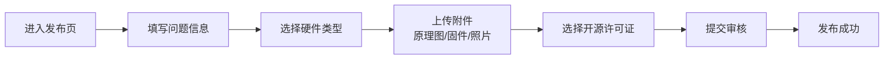
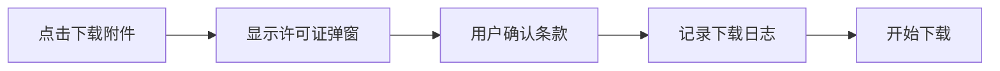

## 1. 产品概述

开源硬件问答社区是一个专注于硬件开发领域的知识分享平台，旨在帮助开发者解决电路板设计、传感器调试、外壳制作等硬件相关问题。

- 主要服务于电子工程师、创客、硬件爱好者，提供问题发布、方案解答、知识沉淀的完整闭环
- 核心价值在于构建高质量的硬件知识库，通过许可证机制保护开源成果，避免商业闭源项目误用

## 2. 核心功能

### 2.1 用户角色

| 角色 | 注册方式 | 核心权限 |
|------|----------|----------|
| 普通用户 | 邮箱/用户名注册 | 浏览问题、发布问题、回答问题、下载附件 |
| 认证开发者 | 资质审核后认证 | 标记方案已验证、参与知识库管理 |

### 2.2 功能模块

1. **首页**：问题列表展示、分类筛选、热门推荐、搜索功能
2. **问题发布页**：问题描述、硬件类型选择、附件上传（原理图/固件/照片）、许可证选择
3. **问题详情页**：问题展示、附件预览、回答列表、验证标记、采纳功能
4. **回答发布**：答案编辑、验证状态标记、补充附件
5. **知识库页**：已采纳方案列表、分类浏览、知识检索
6. **许可证提示**：下载前许可证确认、许可证信息展示

### 2.3 页面详情

| 页面名称 | 模块名称 | 功能描述 |
|----------|----------|----------|
| 首页 | 导航栏 | Logo、搜索框、发布按钮、用户菜单 |
| 首页 | 分类筛选 | 按电路板/传感器/外壳/其他分类 |
| 首页 | 问题列表 | 问题卡片展示，包含标题、标签、回答数、状态 |
| 问题发布页 | 表单区域 | 标题、描述、硬件类型、固件版本输入 |
| 问题发布页 | 附件上传 | 原理图(PDF)、固件(bin/hex)、测试照片上传 |
| 问题发布页 | 许可证选择 | CC BY-SA/MIT/GPL 等开源许可证选择 |
| 问题详情页 | 问题展示 | 完整问题描述、元数据、附件列表 |
| 问题详情页 | 回答列表 | 按投票排序、验证标记、采纳标记 |
| 问题详情页 | 回答编辑器 | Markdown 编辑、验证状态勾选 |
| 知识库页 | 知识卡片 | 已采纳方案展示，包含问题、最佳答案、标签 |
| 许可证弹窗 | 许可证确认 | 下载前显示许可证条款、商用限制提示 |

## 3. 核心流程

### 3.1 问题发布流程

用户在社区发布硬件问题，填写详细信息并上传相关附件，选择合适的开源许可证后提交。

### 3.2 问题解答流程

其他用户浏览问题后提供解决方案，可标记方案是否已验证，提问者采纳最佳答案。

### 3.3 附件下载流程

用户下载附件前需确认许可证条款，系统记录下载行为，保护开源成果。

## 4. 用户界面设计

### 4.1 设计风格

采用工业科技风格，深色调为主，配合电路纹理和科技感元素，体现硬件开发的专业属性。

- **主色调**：深邃蓝 (#0A1929) 作为背景主色
- **强调色**：电路绿 (#00FF88) 用于交互元素和状态标记
- **辅助色**：警示橙 (#FF6B35) 用于验证标记、许可证提示
- **字体**：使用 JetBrains Mono 作为代码和技术文本字体，Space Grotesk 作为标题字体
- **布局**：卡片式布局，左侧导航，主内容区三栏或双栏自适应
- **图标**：线条风格图标，配合电路元素装饰

### 4.2 页面设计概述

| 页面名称 | 模块名称 | UI 元素 |
|----------|----------|----------|
| 首页 | 导航栏 | 深色背景、荧光绿 Logo、搜索框带发光效果 |
| 首页 | 问题卡片 | 悬浮阴影、标签用彩色圆角、状态徽章（已解决/验证中） |
| 问题详情页 | 代码块 | 等宽字体、语法高亮、行号显示 |
| 问题详情页 | 附件预览 | 缩略图网格、hover 放大效果、许可证标签 |
| 回答区域 | 验证标记 | 橙色边框 + 对勾图标、验证者信息 |
| 许可证弹窗 | 提示区域 | 橙色高亮、商用警告图标、确认按钮带脉冲动画 |
| 知识库页 | 知识卡片 | 绿色边框标记、采纳时间戳、关联问题链接 |

### 4.3 响应式设计

- 桌面端：左侧固定导航栏，主内容区最大宽度 1200px
- 平板端：导航栏收起为汉堡菜单，内容区双栏布局
- 移动端：单栏流式布局，底部导航，附件预览单列排列
- 触摸优化：按钮最小尺寸 44px，手势缩放查看原理图

### 4.4 视觉细节

- 背景添加细微电路线路纹理作为装饰
- 卡片悬浮时有 4px 提升阴影和轻微发光效果
- 验证状态切换有平滑过渡动画
- 附件上传区域有虚线边框，拖入时有高亮动画
- 许可证确认按钮采用脉冲动画提示用户注意
