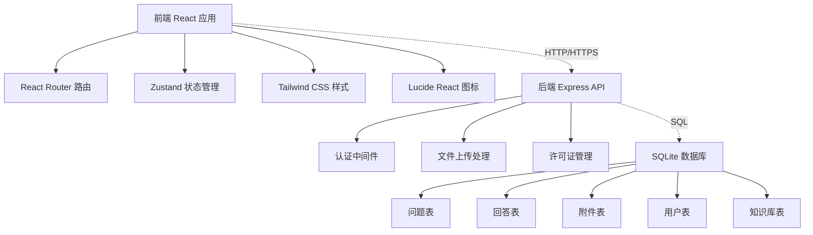
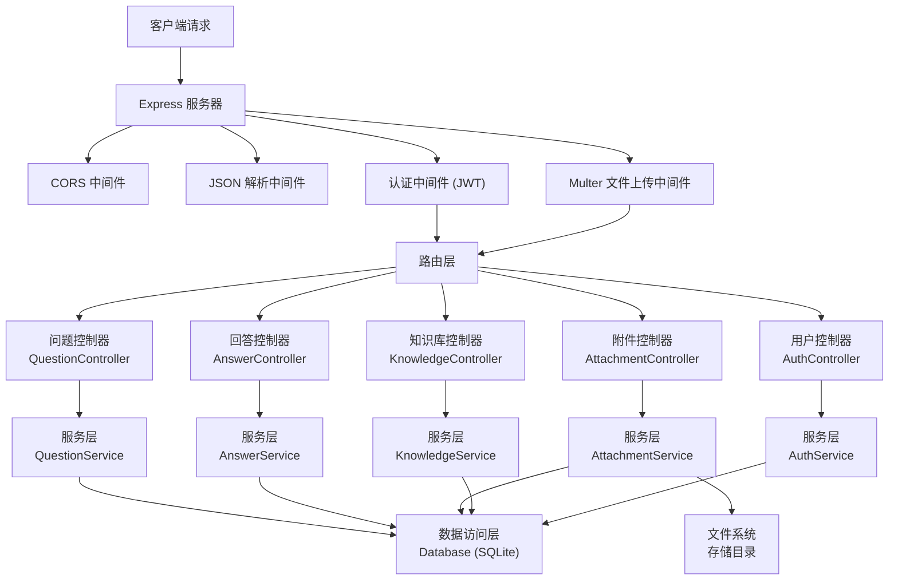
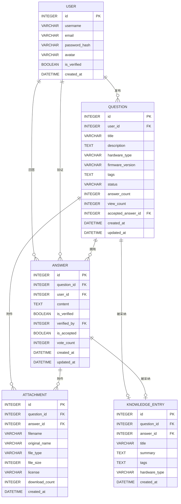

## 1. 架构设计

采用前后端分离架构，前端使用 React 实现单页应用，后端使用 Express 提供 RESTful API，数据存储使用 SQLite 便于快速开发和部署。



## 2. 技术描述

- **前端**：React@18 + TypeScript + Vite + TailwindCSS@3 + Zustand + React Router DOM
- **后端**：Express@4 + TypeScript + Multer（文件上传）
- **数据库**：SQLite + better-sqlite3
- **图标库**：lucide-react
- **初始化工具**：vite-init

## 3. 路由定义

| 路由 | 页面 | 说明 |
|------|------|------|
| `/` | 首页 | 问题列表、搜索、分类筛选 |
| `/question/:id` | 问题详情页 | 查看问题、回答列表、附件下载 |
| `/ask` | 发布问题页 | 新建问题表单 |
| `/knowledge` | 知识库页 | 已采纳方案列表 |
| `/knowledge/:id` | 知识详情页 | 查看完整知识条目 |
| `/login` | 登录页 | 用户登录 |
| `/register` | 注册页 | 用户注册 |

## 4. API 定义

### 4.1 TypeScript 类型定义

```typescript
// 用户类型
interface User {
  id: number;
  username: string;
  email: string;
  avatar?: string;
  isVerified: boolean;
  createdAt: string;
}

// 附件类型
interface Attachment {
  id: number;
  questionId?: number;
  answerId?: number;
  filename: string;
  originalName: string;
  fileType: 'schematic' | 'firmware' | 'photo' | 'other';
  fileSize: number;
  license: string;
  downloadCount: number;
  createdAt: string;
}

// 问题类型
interface Question {
  id: number;
  userId: number;
  title: string;
  description: string;
  hardwareType: 'circuit' | 'sensor' | 'case' | 'other';
  firmwareVersion?: string;
  tags: string[];
  status: 'open' | 'solved';
  answerCount: number;
  viewCount: number;
  acceptedAnswerId?: number;
  createdAt: string;
  updatedAt: string;
  user?: User;
  attachments?: Attachment[];
}

// 回答类型
interface Answer {
  id: number;
  questionId: number;
  userId: number;
  content: string;
  isVerified: boolean;
  verifiedBy?: number;
  isAccepted: boolean;
  voteCount: number;
  createdAt: string;
  updatedAt: string;
  user?: User;
  attachments?: Attachment[];
}

// 知识库类型
interface KnowledgeEntry {
  id: number;
  questionId: number;
  answerId: number;
  title: string;
  summary: string;
  tags: string[];
  hardwareType: string;
  createdAt: string;
}

// 许可证类型
interface License {
  id: string;
  name: string;
  fullName: string;
  url: string;
  commercialUse: boolean;
  attributionRequired: boolean;
  shareAlike: boolean;
  description: string;
}
```

### 4.2 API 端点

| 方法 | 端点 | 说明 | 请求体 | 响应 |
|------|------|------|--------|------|
| GET | `/api/questions` | 获取问题列表 | `{ page?, limit?, category?, search? }` | `Question[]` |
| GET | `/api/questions/:id` | 获取问题详情 | - | `Question` |
| POST | `/api/questions` | 创建问题 | `{ title, description, hardwareType, firmwareVersion?, tags, license }` + 附件 | `Question` |
| PUT | `/api/questions/:id` | 更新问题 | `{ title, description, hardwareType, tags }` | `Question` |
| GET | `/api/questions/:id/answers` | 获取问题的回答列表 | - | `Answer[]` |
| POST | `/api/questions/:id/answers` | 提交回答 | `{ content, isVerified }` + 附件 | `Answer` |
| POST | `/api/answers/:id/accept` | 采纳回答 | - | `{ success: boolean }` |
| POST | `/api/answers/:id/verify` | 标记验证 | `{ isVerified }` | `Answer` |
| POST | `/api/answers/:id/vote` | 投票 | `{ direction: 1 | -1 }` | `Answer` |
| GET | `/api/knowledge` | 获取知识库列表 | `{ page?, limit?, category?, search? }` | `KnowledgeEntry[]` |
| GET | `/api/knowledge/:id` | 获取知识详情 | - | `KnowledgeEntry & { question: Question, answer: Answer }` |
| GET | `/api/attachments/:id/download` | 下载附件 | - | 文件流 |
| POST | `/api/auth/login` | 用户登录 | `{ username, password }` | `{ user: User, token: string }` |
| POST | `/api/auth/register` | 用户注册 | `{ username, email, password }` | `{ user: User, token: string }` |
| GET | `/api/licenses` | 获取许可证列表 | - | `License[]` |

## 5. 服务器架构图



## 6. 数据模型

### 6.1 ER 图



### 6.2 DDL 语句

```sql
-- 用户表
CREATE TABLE users (
    id INTEGER PRIMARY KEY AUTOINCREMENT,
    username VARCHAR(50) UNIQUE NOT NULL,
    email VARCHAR(100) UNIQUE NOT NULL,
    password_hash VARCHAR(255) NOT NULL,
    avatar VARCHAR(255),
    is_verified BOOLEAN DEFAULT 0,
    created_at DATETIME DEFAULT CURRENT_TIMESTAMP
);

-- 问题表
CREATE TABLE questions (
    id INTEGER PRIMARY KEY AUTOINCREMENT,
    user_id INTEGER NOT NULL,
    title VARCHAR(200) NOT NULL,
    description TEXT NOT NULL,
    hardware_type VARCHAR(20) NOT NULL,
    firmware_version VARCHAR(50),
    tags TEXT,
    status VARCHAR(20) DEFAULT 'open',
    answer_count INTEGER DEFAULT 0,
    view_count INTEGER DEFAULT 0,
    accepted_answer_id INTEGER,
    created_at DATETIME DEFAULT CURRENT_TIMESTAMP,
    updated_at DATETIME DEFAULT CURRENT_TIMESTAMP,
    FOREIGN KEY (user_id) REFERENCES users(id),
    FOREIGN KEY (accepted_answer_id) REFERENCES answers(id)
);

-- 回答表
CREATE TABLE answers (
    id INTEGER PRIMARY KEY AUTOINCREMENT,
    question_id INTEGER NOT NULL,
    user_id INTEGER NOT NULL,
    content TEXT NOT NULL,
    is_verified BOOLEAN DEFAULT 0,
    verified_by INTEGER,
    is_accepted BOOLEAN DEFAULT 0,
    vote_count INTEGER DEFAULT 0,
    created_at DATETIME DEFAULT CURRENT_TIMESTAMP,
    updated_at DATETIME DEFAULT CURRENT_TIMESTAMP,
    FOREIGN KEY (question_id) REFERENCES questions(id),
    FOREIGN KEY (user_id) REFERENCES users(id),
    FOREIGN KEY (verified_by) REFERENCES users(id)
);

-- 附件表
CREATE TABLE attachments (
    id INTEGER PRIMARY KEY AUTOINCREMENT,
    question_id INTEGER,
    answer_id INTEGER,
    filename VARCHAR(255) NOT NULL,
    original_name VARCHAR(255) NOT NULL,
    file_type VARCHAR(20) NOT NULL,
    file_size INTEGER NOT NULL,
    license VARCHAR(50) NOT NULL,
    download_count INTEGER DEFAULT 0,
    created_at DATETIME DEFAULT CURRENT_TIMESTAMP,
    FOREIGN KEY (question_id) REFERENCES questions(id),
    FOREIGN KEY (answer_id) REFERENCES answers(id)
);

-- 知识库表
CREATE TABLE knowledge_entries (
    id INTEGER PRIMARY KEY AUTOINCREMENT,
    question_id INTEGER NOT NULL,
    answer_id INTEGER NOT NULL,
    title VARCHAR(200) NOT NULL,
    summary TEXT NOT NULL,
    tags TEXT,
    hardware_type VARCHAR(20) NOT NULL,
    created_at DATETIME DEFAULT CURRENT_TIMESTAMP,
    FOREIGN KEY (question_id) REFERENCES questions(id),
    FOREIGN KEY (answer_id) REFERENCES answers(id)
);

-- 投票表
CREATE TABLE votes (
    id INTEGER PRIMARY KEY AUTOINCREMENT,
    answer_id INTEGER NOT NULL,
    user_id INTEGER NOT NULL,
    direction INTEGER NOT NULL,
    created_at DATETIME DEFAULT CURRENT_TIMESTAMP,
    UNIQUE(answer_id, user_id),
    FOREIGN KEY (answer_id) REFERENCES answers(id),
    FOREIGN KEY (user_id) REFERENCES users(id)
);

-- 索引
CREATE INDEX idx_questions_status ON questions(status);
CREATE INDEX idx_questions_hardware_type ON questions(hardware_type);
CREATE INDEX idx_answers_question ON answers(question_id);
CREATE INDEX idx_knowledge_hardware_type ON knowledge_entries(hardware_type);
```
